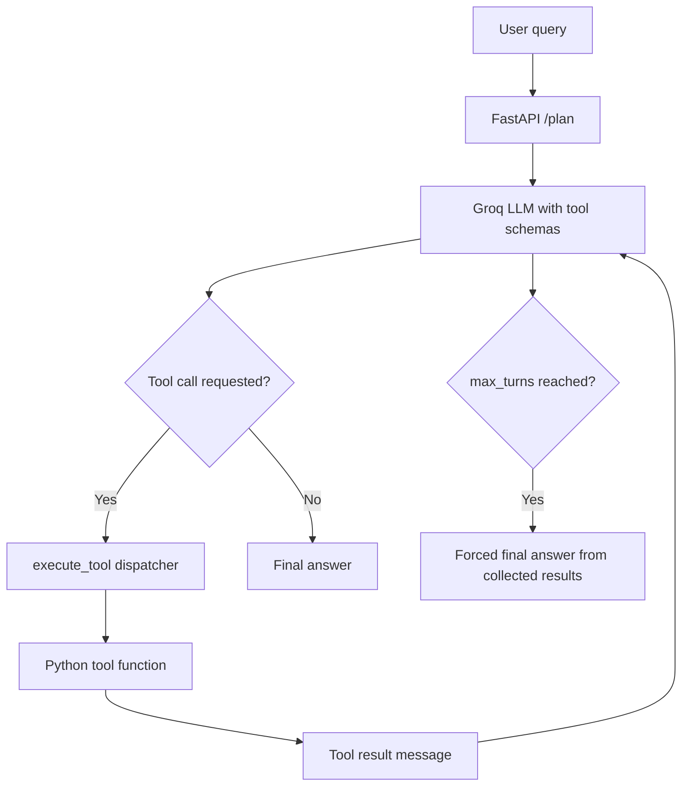
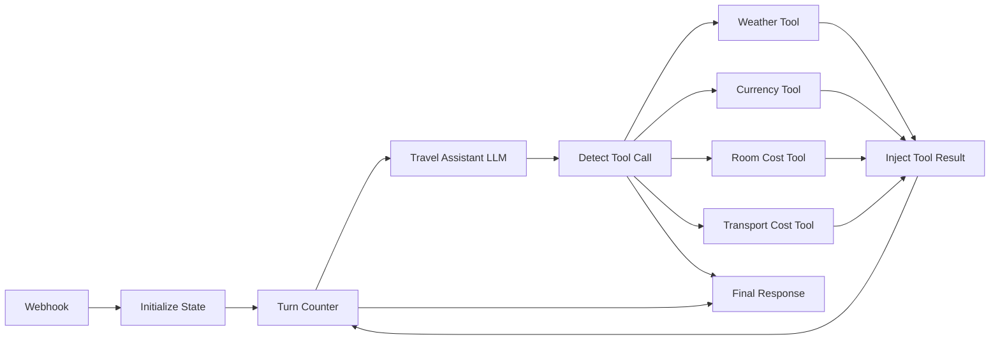

# Lab 08: Agentic AI Tool Use Pattern

Professional FastAPI implementation of the Lab 08 Tool Use Pattern by **M Abdullah Fawad**.

The project demonstrates a Groq-powered agent that reads JSON tool schemas, requests structured tool calls, executes local Python functions, injects results back into the model context, and stops when it has enough information or reaches `max_turns`.

## What Is Included

- FastAPI backend with `GET /health` and `POST /plan`.
- Modern static UI served from FastAPI at `/`.
- Groq `llama-3.1-8b-instant` tool-calling loop.
- Four tools: weather, currency, flight cost, and Pakistani prayer times.
- Postman collection in `docs/postman_collection.json`.
- n8n Student Hostel Planner workflow in `n8n/student-hostel-tool-use-workflow.json`.
- Reflection answer and sample responses in `docs/`.

## Setup

```bash
python -m venv .venv
.venv\Scripts\activate
pip install -r requirements.txt
copy .env.example .env
```

Add your rotated Groq key to `.env`:

```env
GROQ_API_KEY=your_rotated_groq_api_key
GROQ_MODEL=llama-3.1-8b-instant
TOOL_USE_DEMO_MODE=false
```

Run the server:

```bash
uvicorn main:app --reload --port 8000
```

Open:

- UI: <http://127.0.0.1:8000>
- Swagger docs: <http://127.0.0.1:8000/docs>
- Health check: <http://127.0.0.1:8000/health>

For offline screenshots without an API key, set `TOOL_USE_DEMO_MODE=true`.

## API Examples

Health check:

```bash
curl http://127.0.0.1:8000/health
```

Single tool call:

```bash
curl -X POST http://127.0.0.1:8000/plan ^
  -H "Content-Type: application/json" ^
  -d "{\"query\":\"What is the current weather in Dubai?\",\"max_turns\":5}"
```

Multi-tool query:

```bash
curl -X POST http://127.0.0.1:8000/plan ^
  -H "Content-Type: application/json" ^
  -d "{\"query\":\"I want to travel from Islamabad to London for 2 people. What will it cost in GBP, and what is the weather like there?\",\"max_turns\":5}"
```

Prayer-times query:

```bash
curl -X POST http://127.0.0.1:8000/plan ^
  -H "Content-Type: application/json" ^
  -d "{\"query\":\"What are the prayer times in Islamabad today?\",\"max_turns\":5}"
```

## Architecture





## Screenshots

| Evidence | File |
| --- | --- |
| Modern UI | `docs/screenshots/ui-home.png` |
| Health returns four tools | `docs/screenshots/health.png` |
| Single weather tool call | `docs/screenshots/single-tool-weather.png` |
| Multi-tool trip query | `docs/screenshots/multi-tool-london.png` |
| max_turns safety limit | `docs/screenshots/max-turns.png` |
| Prayer-times tool call | `docs/screenshots/prayer-times.png` |
| Combined Karachi query | `docs/screenshots/combined-karachi.png` |
| n8n workflow canvas | `docs/screenshots/n8n-workflow.png` |

## Graded Task 1 Notes

`get_prayer_times(city, date)` was added by editing only:

- `tools.py`
- `schemas.py`

The core loop in `main.py` was left unchanged. This proves the Tool Use Pattern separates tool definitions and execution registry from the generic dispatch loop.

Reflection answer: see `docs/reflection.md`.

## n8n Workflow

Import `n8n/student-hostel-tool-use-workflow.json` into n8n.

Student Hostel Planner domain tools:

- `get_room_cost(city, university)`
- `get_transport_cost(from_city, to_city)`

Domain justification:

Student hostel planning depends on room prices, campus area, and inter-city transport costs that change by city and season. An LLM cannot know current local hostel availability or accurate student transport estimates from training data alone. Tool use lets the workflow fetch or simulate these facts, inject them into the LLM context, and produce a grounded final answer.

The local machine used for this repository did not have the `n8n` CLI installed, so the repository includes an importable workflow JSON and a generated canvas-style screenshot for documentation. Import the JSON into n8n for the live execution demonstration.

## Evaluation Checklist

- `/health` returns four tool names.
- Weather query calls `get_weather` with `turn_count` 1.
- London trip query calls flight, currency, and weather tools.
- Prayer query calls `get_prayer_times`.
- Karachi combined query calls weather, prayer, and flight tools.
- `max_turns` stops long chains safely.
- n8n workflow includes Webhook, Groq HTTP Request, Switch, Code tools, Turn Counter, and Final Response.

## References

- Groq model docs for `llama-3.1-8b-instant`: <https://console.groq.com/docs/model/llama-3.1-8b-instant>
- Groq Tool Use docs: <https://console.groq.com/docs/tool-use>
- n8n workflow import docs: <https://docs.n8n.io/workflows/export-import/>
- n8n Webhook docs: <https://docs.n8n.io/integrations/builtin/core-nodes/n8n-nodes-base.webhook/>
